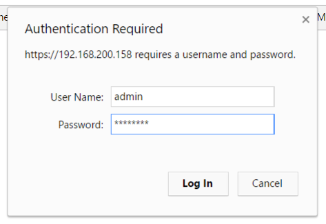
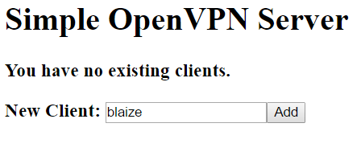
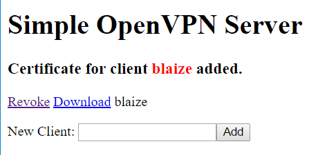

	````
## Adjust Templates variables and variables in variables.tf

    There are number of varibale options the terraform will accept - located in variables.tf
    Any script file that has ending of .template will have template variables that will be placing in the template files during rendering.

    ${var.VPN_PORT}		-- The port to be used by OpenVPN. The default port is **1194**.
    ${var.VPN_PROTOCOL}		-- The protocol to be used by OpenVPN. This accepts **udp** or tcp. The default is **udp**.
    ${var.VPN_CLIENT["CIDR"]}	-- The Client Subnet CIDR ie 24
    ${var.VPN_CLIENT["SUBNET"]}	-- The Client Network i.e 10.8.0.0 
    ${var.VPN_CLIENT["NETMASK"]} - The Client Netmask i.e 255.255.255.0 
    ${var.VPN_HUB["SUBNET"]}	-- The VPN Server Network i.e 10.1.0.0 
    ${var.VPN_HUB["NETMASK"]}	-- The VPN Server Netmask i.e 255.255.255.0
    ${var.VPN_CLIENT["CIDR"]}	-- The VPN Server Subnet CIDR ie 24
    ${var.VPN_DNS1}		-- The first dns server assigned to the clients. 
    ${var.VPN_DNS2}		-- The Secoon dns server assigned to the clients.
    ${var.location}		-- The Region that the resource group will located default Centralus (no space)
    ${var.vpnserver_hostname}"	-- The host name of the VPN server.
    ${var.VPN_PRIVATE_IP}"	-- The Private IP of the VPN server. -Disable but can be enable by uncommenting
    ${var.DOMAIN["VPNSERVER"]}	-- VPNSERVER Hostname in a map variable
    ${var.DOMAIN["LOCATION"]}	-- VPNSERVER Geo Location in map variable
    ${var.DOMAIN["ZONE"]}"	-- VPNSERVER DNS zone in map
    ${var.VPN_COMPRESSION}"	-- VPN Server compression setting ie lzo lz4 or blank
    -- Lots More in variables.tf -- 

1. Let the Terraform apply finish. This may take a few minutes. 

1. If the server you are installing this on is behind a firewall, be sure that you forward the external ports from the firewall to the ports on the server for the VPN. Optionally, if you want to be able to manage the VPN from outside the firewall, forward a port to 443 on the VPN Server.


## Managing Profiles

1. Once the script is complete, point your browser to **https://[your host or IP]/**, where your host or IP is the host name or IP addressed for the VPN. You may get an error about the site not being secure even though you are using https. This is because the site is using a self-esigned certificate. Simply ignore the warning. 

1. Logon to the admin site. Use **admin** for the username and the password used for the **adminpassword** option when the installer was run. If you did not supply one, use **password**.

	

1. Once logged on, enter a name for the client and click **Add**.

	

1. Once added, you can click **Revoke** to revoke access or **Download** to download the client profile. 

	

## Connecting to the Server

Once the profile is downloaded you need to configure a client:

* **Windows**: use [OpenVPN GUI](https://openvpn.net/index.php/open-source/downloads.html). After installing the app, copy the .ovon to the **C:\Program Files\OpenVPN\config** folder. Launch the GUI from your Start menu, then right click the icon in the Tool Tray, then click **Connect**. Disconnect by right clicking and selecting **Disconnect**.

* **MacOS** (OS X): use [Tunnelblick](https://tunnelblick.net/downloads.html). Download and install Tunnelblick. After downloading, double-click on the downloaded .ovpn file and import the configuration either for yourself or all users. Once imported, click the Tunnleblick icon on the menu bar and click **Connect**. Disconnect by clicking the Tunnelblick icon and selecting **Disconnect**.

* **Android**: use [OpenVPN Connect for Android](https://play.google.com/store/apps/details?id=net.openvpn.openvpn&hl=en). Download and install the app. Next, go to the admin site and create and/or download a profile. In the app, select Import from the menu, then select **Import**, then select **Import Profile from SD card**. Find the profile in your **Downloads** folder and import the profile. Once downloaded, click **Connect**. To disconnect, open the app again and select **Disconnect**.

* **iOS**: use [OpenVPN Connect for iOS](https://itunes.apple.com/us/app/openvpn-connect/id590379981?mt=8). Install the app, then browse to the admin site in Safari. Create and/or download a profile. After the profile is downloaded, select **Open in Open VPN**. Install the profile, then select **Connect** to connect to the VPN. To disconnect, open the app again and select **Disconnect**.

